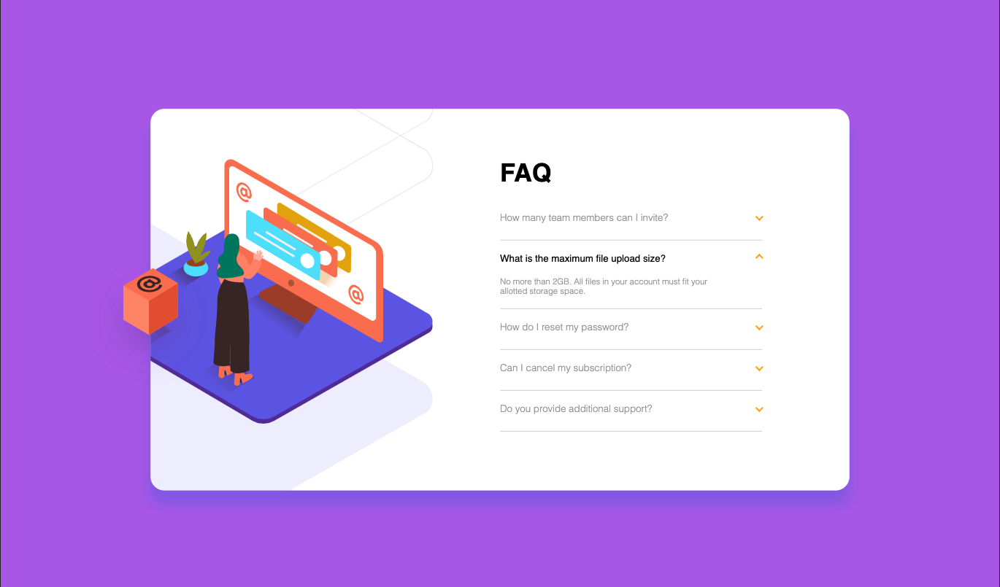
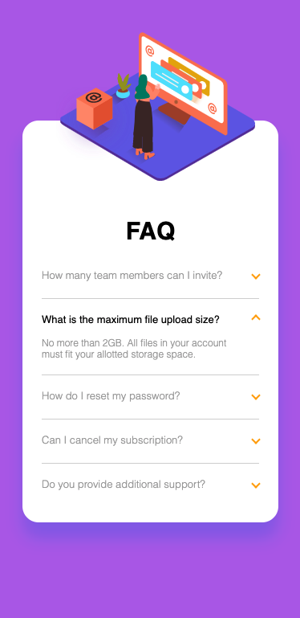

# Frontend Mentor - FAQ accordion card solution

This is a solution to the [FAQ accordion card challenge on Frontend Mentor](https://www.frontendmentor.io/challenges/faq-accordion-card-XlyjD0Oam). Frontend Mentor challenges help you improve your coding skills by building realistic projects.

### The challenge

Users should be able to:

- View the optimal layout for the component depending on their device's screen size
- See hover states for all interactive elements on the page
- Hide/Show the answer to a question when the question is clicked

### Screenshots

### Links

- Solution URL: [GitHub](https://github.com/13Groszy/FrontendMentorFAQ)
- Live Site URL: [Netlify](https://13groszyfrontendmentorfaq.netlify.app)

## My process
I've created a basic skeleton of the page first, then styled it and implement some interactive elements. At the end I've re-designed it to be friendly for all device's screen size.

Update 1.0
Following the feedback I've redesigned CSS fully and now:
    -Height of container has been deleted so layout expand naturally when need.
    -FAQ questions now have just one class instead od having few this same functions.
    -Proportions are much closer to the oryginal design.
    
### Built with

- Semantic HTML5 markup
- CSS custom properties
- Flexbox
- jQuery

### Continued development

Future projects will mostly focus on mobile-first workflow. I also feel that I should focus more on CSS properties to understand them better and choose the best fitting one straight away instead of trying few before.

## Author

- Website - [Portfolio](https://mdaszkiewicz.netlify.app)
- Frontend Mentor - [@yourusername](https://www.frontendmentor.io/profile/13Groszy)
